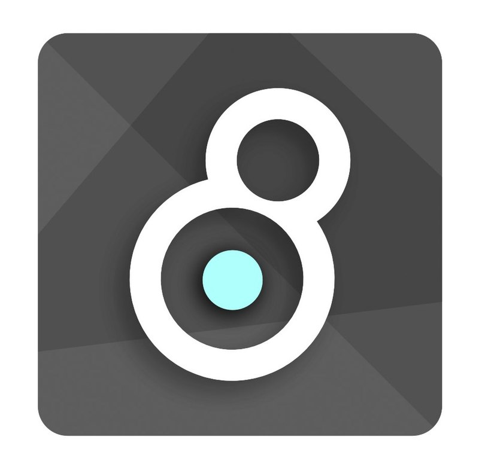

# Coding Blog

## What I've learnt so far

Since November 2022 I started focusing on coding as a career option. I had used various visual coding languages, such as Reaktor and MaxMSP, for audio-visual projects. This was very engaging and it felt like a logical step to take it further into app/web development, and any other directions this path may take.

---

## CS50x

---

## CS50p

---

## CS50w

---

## freeCodeCamp

HTML and CSS

---

## Scrimba's Learn React

---
---

